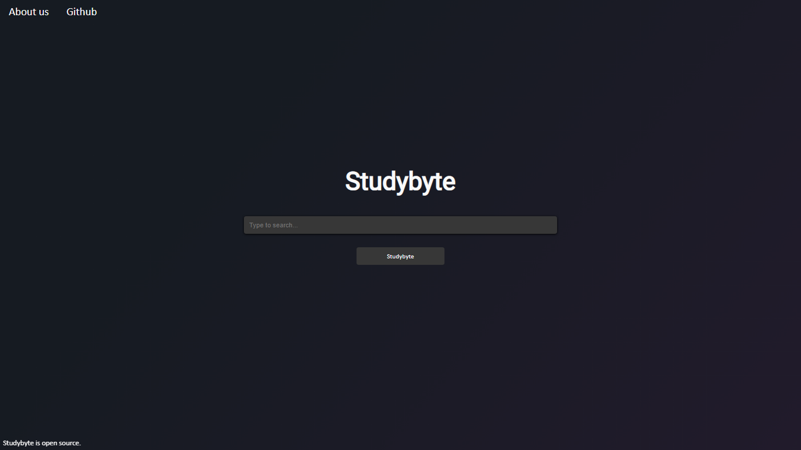

# Studybyte
Studybyte is a search engine designed to help students find educational content effortlessly. As it is open source, you can freely look into it's source code, understand and improve it.

---

## Getting Started
Visual Studio Code is recommended.

<ins>**1. Downloading the repository:**</ins>

Start by cloning the repository with `git clone https://github.com/Light-Lens/Studybyte`.

<ins>**2. Web Crawler**</ins>

***NOTE: The Web crawler that is used in Studybyte was not created by me.***
1. The Web crawler was created by [tasos-py](https://github.com/tasos-py).
2. Check out [Search-Engines-Scraper](https://github.com/tasos-py/Search-Engines-Scraper) on GitHub

---

## FAQ
### 1. Why To Use Studybyte?
You may have faced an issue where you do a Google search for a question and it costs you almost 3-4 searches to find the solution you were actually looking for, but with Studybyte that's not the case.

Studybyte is optimized for students to find educational content effortlessly. All the pages which will rank on Studybyte will only be coming from trusted sources, and all the pages will be ranked organically through it's search algorithm, Color. Color is a search algorithm which was recycled from one of my old search engines, [Cpix](https://www.youtube.com/watch?v=eqpWT9X28Ls), after some major changes in the search algorithm it now ranks only educational content onto it's results page.

Now obviously it's nearly impossible to beat Google, but as Studybyte is highly focused to Organise Educational Content at one place, it's in a lead.

### 2. Is Studybyte Safe?
Yes, Studybyte is totally safe to use, it neither collects your data nor tracks you, and if you still doubt you can review Studybyte's source code.

### 3. Is Studybyte Free?
Yes, Studybyte is totally free and it's open source too. So, if you want then you can download it's source code and contribute to it.

### 4. Do I Need To Have An Account To Use Studybyte?
No, You don't need to have any kind of account to use Studybyte. Just open the site and start exploring.

### 5. How Do I Add My Website To Studybyte?
Currently if you want to add a website to Studybyte's index then you have to add it in the source code manually and create a GitHub pull request. But soon the process will be automated with Google Forms.

---

## Features
Studybyte has a feature known as Search Tags. Search Tags are some keywords which you can use to search instantly on other search engines from Studybyte's search bar. To use this feature you need to add these keywords at the beginning of your query.

Currently implemented Search Tags are:
- Search to Google using `g?`
- Search to Google Scholar using `gs?`
- Search to YouTube using `yt?`
- Search to Britannica using `eb?`
- Search to Github using `git?`
- Search to Bing using `bing?`
- Search to PDFDrive using `pdfdrive?`
- Search to DuckDuckGo using `ddg?`

## Requirments
You need to install the following on your machine.
- Python 3 (Must install all required modules)
- Google Chrome (or any other Web Browser, it must be Up-To-Date and Javascript must be enabled)
- Visual Studio Code (or any other IDE)

## License and Contributions
All code is licensed under an MIT license. This allows you to re-use the code freely, remixed in both commercial and non-commercial projects. The only requirement is to include the same license when distributing.

